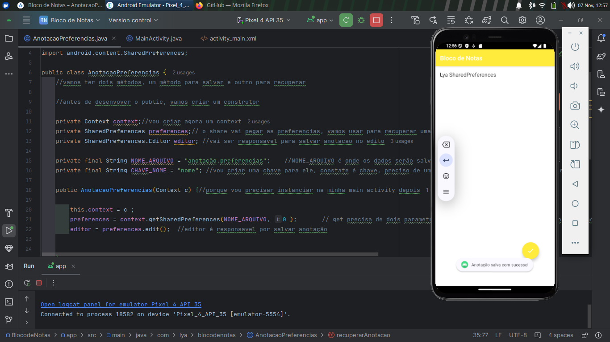

Bloco de Notas - Aplicativo Android
O Bloco de Notas é um aplicativo simples desenvolvido para armazenar e recuperar anotações do usuário. Ele permite que o usuário salve uma anotação rapidamente e exibe uma mensagem de confirmação, além de carregar automaticamente a última anotação salva ao abrir o aplicativo.
Principais Funcionalidades:

    Salvamento de Anotações: O usuário pode escrever uma anotação no campo de texto e clicar no botão de salvar (FloatingActionButton). O aplicativo verifica se o campo está vazio antes de salvar, exibindo uma mensagem de alerta caso o usuário não tenha digitado nada.
    Validação de Entrada: Antes de salvar, o aplicativo verifica se o campo de anotação está vazio. Se estiver, exibe um Toast com a mensagem "Preencha a anotação!" para orientar o usuário.
    Recuperação de Anotação: Ao iniciar o aplicativo, ele carrega automaticamente a última anotação salva e exibe no campo de texto, permitindo que o usuário continue de onde parou.
    Feedback Visual com Toast: O aplicativo utiliza Toast para dar feedback ao usuário, exibindo mensagens rápidas como "Preencha a anotação!" para entradas vazias e "Anotação salva com sucesso!" após o salvamento.

Tecnologias e Conceitos Utilizados:

    SharedPreferences: A classe AnotacaoPreferencias utiliza SharedPreferences para salvar e recuperar as anotações, permitindo armazenamento persistente de dados simples.
    Validação de Campo: Condicional if para verificar se o campo de anotação está vazio antes de realizar o salvamento.
    Interface de Usuário Simples e Intuitiva: Uso de um FloatingActionButton para salvar anotações, mantendo o layout limpo e funcional.
    Experiência do Usuário (UX): O aplicativo proporciona feedback visual ao usuário por meio de Toast, garantindo que ele seja informado sobre o status de suas ações.
